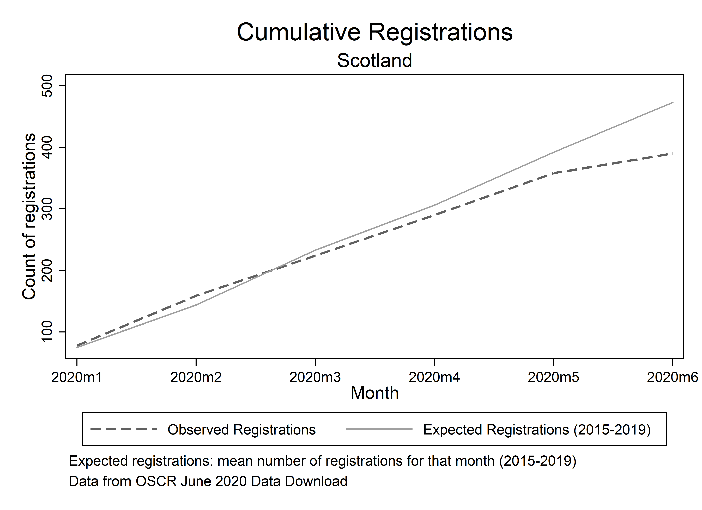
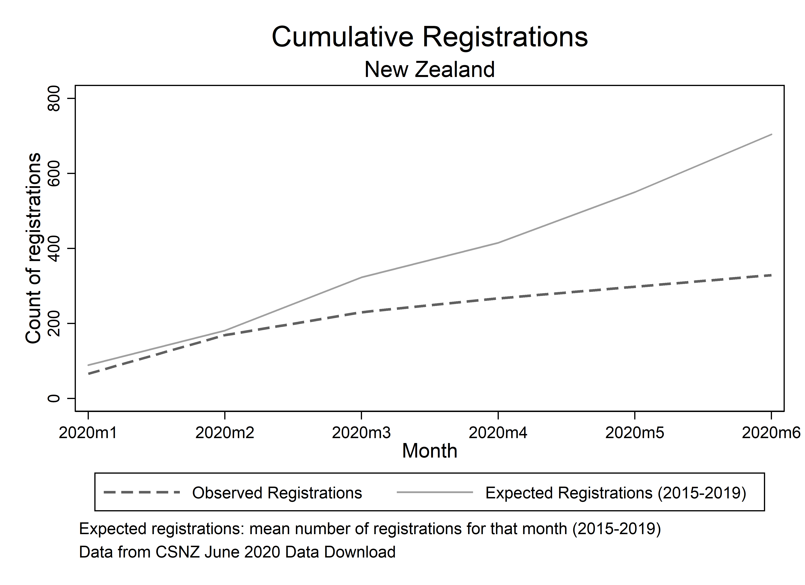
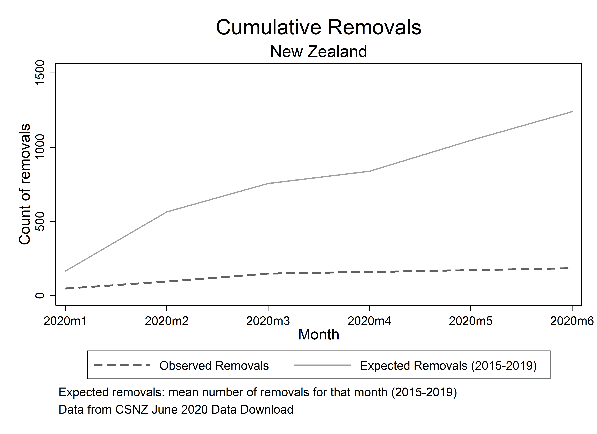
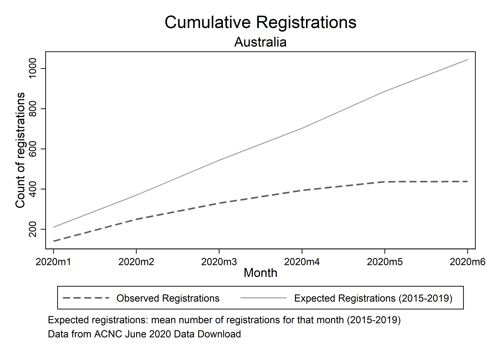
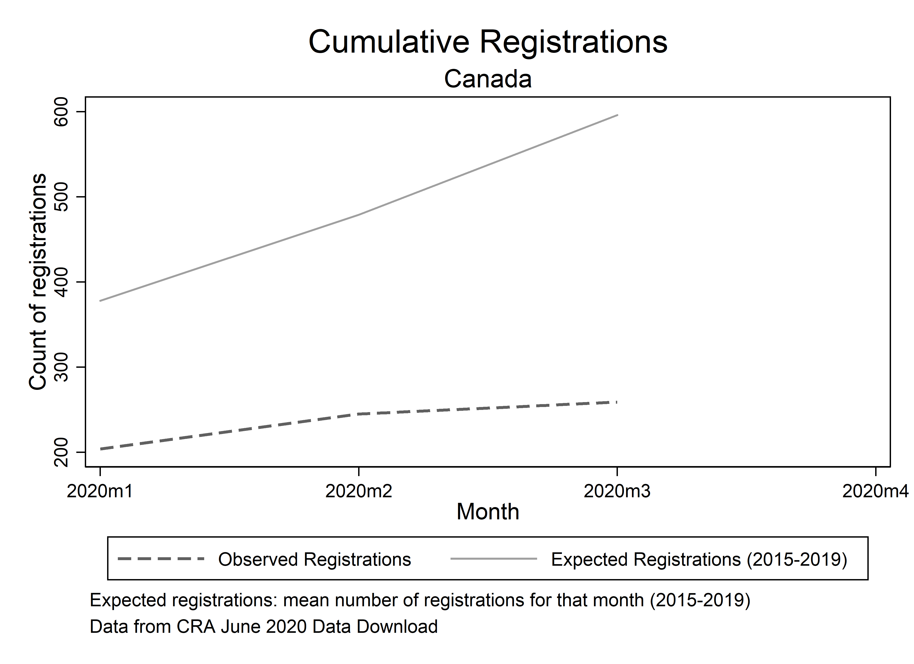
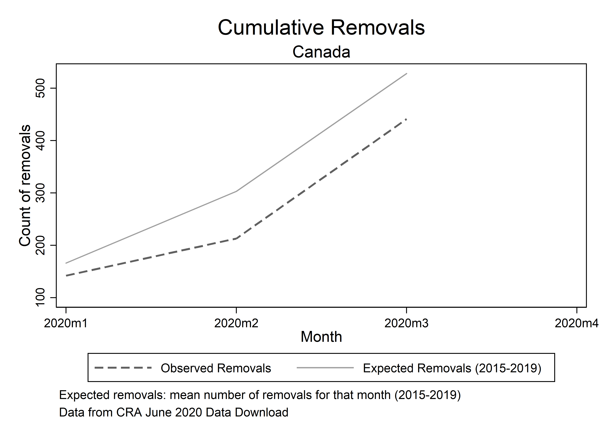
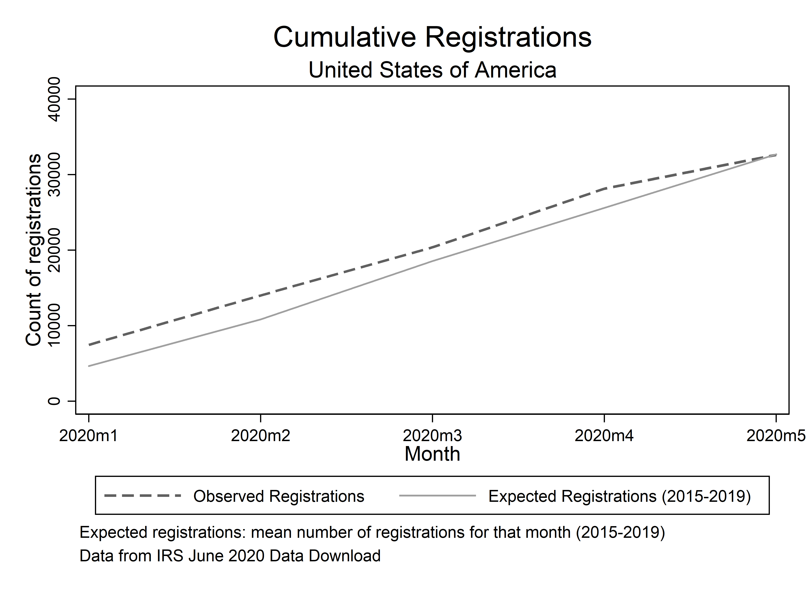

# The impact of COVID-19 on the foundation and dissolution of charitable organisations

## Macro-level analyses

In this analysis we examine the impact of COVID-19 on the foundation and dissolution of charitable organisations across seven jurisdictions. We employ an “excess events” analytical approach, comparing the numbers of foundations (registrations) and dissolutions (removals) in 2020 to what we would expect based on the trends from previous years. This allows us to see particular months that deviate considerably from what we would expect - e.g., where there many more dissolutions in March 2020 than there usually are for this month? -, as well as the running totals for foundations and dissolutions in 2020 - e.g., though foundations were lower in the first half of the year, they rebounded considerably in the latter half to previous levels.

### Scotland

#### Registrations

#### Removals

### England and Wales

#### Registrations

#### Removals

### Northern Ireland

#### Registrations

#### Removals

### New Zealand

#### Registrations

#### Removals

### Australia

#### Registrations

### Canada

#### Registrations

#### Removals

### USA

#### Registrations

#### Removals

